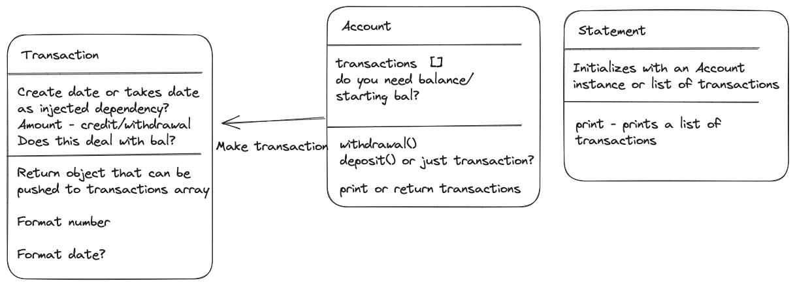
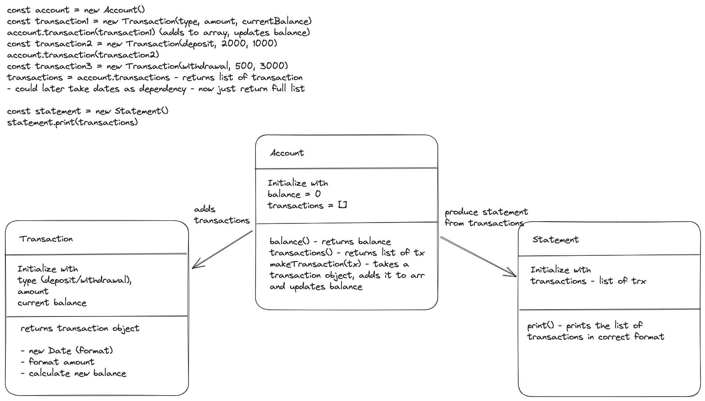

# Bank Tech Test

## Instructions

```plain
git clone https://github.com/sarahc-dev/bank-tech-test.git
cd bank-tech-test
npm install

```

## Acceptance Criteria

**Given** a client makes a deposit of 1000 on 10-01-2023  
**And** a deposit of 2000 on 13-01-2023  
**And** a withdrawal of 500 on 14-01-2023  
**When** she prints her bank statement  
**Then** she would see

```plain
date || credit || debit || balance
14/01/2023 || || 500.00 || 2500.00
13/01/2023 || 2000.00 || || 3000.00
10/01/2023 || 1000.00 || || 1000.00
```

## Planning

Below is a diagram of my initial thoughts/considerations. I did consider the transactions being a part of the Account class, but in wanting to follow the Single Responsibility Principle, I have decided that this should be a class of its own. This left me to consider which class keeps track of the balance, how this should get updated and also how to keep a log of the transactions to be printed.



Following this, I created a list of how I think the program should run and designed my classes.


