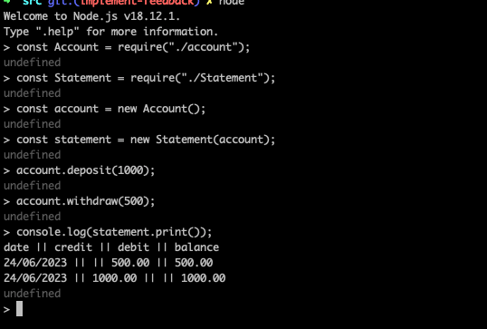
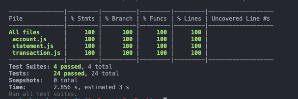

# Bank Tech Test

## Acceptance Criteria

**Given** a client makes a deposit of 1000 on 10-01-2023  
**And** a deposit of 2000 on 13-01-2023  
**And** a withdrawal of 500 on 14-01-2023  
**When** she prints her bank statement  
**Then** she would see

```plain
date || credit || debit || balance
14/01/2023 || || 500.00 || 2500.00
13/01/2023 || 2000.00 || || 3000.00
10/01/2023 || 1000.00 || || 1000.00
```

## Instructions

To run the tests:

```plain
git clone https://github.com/sarahc-dev/bank-tech-test.git
cd bank-tech-test
npm install
npm run test
```

To run the project to match the acceptance critera, in addition to the above:

```plain
cd src
node
const Account = require("./account");
const Transaction = require("./transaction");
const Statement = require("./Statement");
const account = new Account();
const transaction = new Transaction();
const deposit1 = transaction.deposit(new Date("2023-01-10"), 1000, 0);
account.addTransaction(deposit1);
const deposit2 = transaction.deposit(new Date("2023-01-13"), 2000, 1000);
account.addTransaction(deposit2);
const withdrawal1 = transaction.withdrawal(new Date("2023-01-14"), 500, 3000);
account.addTransaction(withdrawal1);
const statement = new Statement();
const printedStatement = statement.print(account.getTransactions());
console.log(printedStatement);
```

## Planning

Below is a diagram of my initial thoughts/considerations. I did consider the transactions being a part of the Account class, but in wanting to follow the Single Responsibility Principle, I have decided that this should be a class of its own. This left me to consider which class keeps track of the balance, how this should get updated and also how to keep a log of the transactions to be printed.

I have decided to structure my code with three classes - transaction; account, which will keep track of the balance, list of transactions, and add instances of the transaction class to the transactions list; and statement, which will take a list of transactions and return a formatted statement.


Following this, I created a list of how I think the program should run and roughly designed my classes.


## Approach

During development, my class design and function names did change as I got a better grasp on what I needed. I have also refactored some of my code into smaller functions. I was initially going to have one transaction function that took the type as a dependency. I also considered deducing this from whether the amount was positive or negative. However, I eventually decided to create a separate deposit and withdrawal function for better readability and following the single responsibility principle. I also chose to inject the date as a dependency to make testing this class easier.

In the Statement class, I eventually chose not to initialise this with the transaction list but instead to add this as an argument to the print function. I'm not sure if there is a benefit to either way, but I thought for future scalability if for instance the transaction list was much longer and you only wanted to print a section of it, it would be better to make this an argument.

I have handled some exceptions, where the type is incorrect or amount is less than 0. I considered handling an edge case where the withdrawal was larger than the balance - but chose not to because this was not in the acceptance criteria.

I am wondering if I have overcomplicated the task, as there are a lot of steps involved in running the project to meet the acceptance criteria.

## Screenshots

Running app:



Test coverage:


